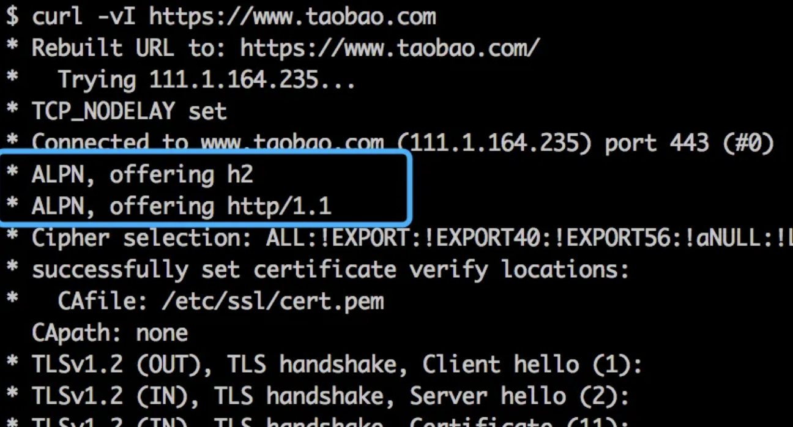
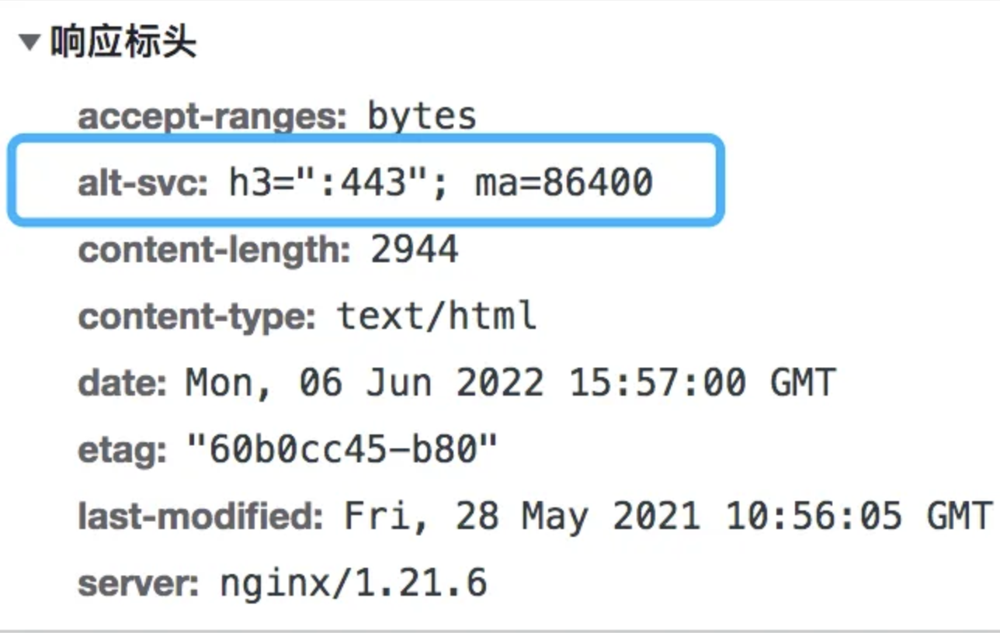

# 浏览器构建 HTTP 请求行时怎么确定 HTTP 版本的

目前主流的 HTTP 协议版本有 HTTP/1.1、HTTP/2、HTTP/3（实验性）。请求发生时具体使用的版本是由客户端主导、客户端和服务器共同协商决定的。比如支持 HTTP/2 的客户端，会在 TLS 握手发起时，在 ALPN（Application-Layer Protocol Negotiation） 扩展中标明自己支持 h2 和 http/1.1，打开 curl 命令的调试模式就能看到：

如果服务器也支持 h2，就会告诉客户端：

不支持也同样会告诉：

浏览器使用 HTTP/2 也是这个原理。但是 HTTP/3 使用了 UDP，UDP 不需要握手，所以没法用和 HTTP/2 相同的方式来进行协商。而是反过来了，是起初先按照普通的 HTTP 1.1/2 进行请求，服务器从这些请求的响应头（alt-svc）中告诉客户端，自己是支持 h3 的。这样如果客户端也支持 h3。就可以在往后的请求中直接使用 h3，ma 是 max-age，表示超过这个时间就得忘掉这个域名是支持 h3 的了。

这种方式就像 HSTS 的缺点一样，前几次请求还是非 h3 的，所以 Chrome 现在在实现另外一种基于 HTTPS-DNS 的方式，就是 NDS 解析一个域名的时候，就已经能得知这个域名是支持 h3 的了：

[知乎](https://www.zhihu.com/question/536319063/answer/2517555802)
