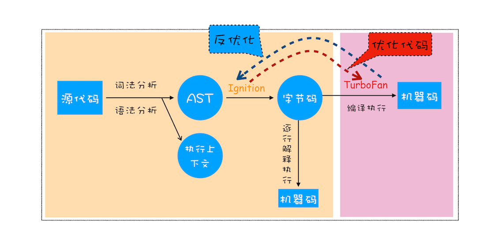

# 变量提升 与 闭包 与 this 与 new 那得从 V8 执行上下文 说起

> chrome 版本 114.0.5735.198（正式版本） (arm64) ，控制台特性一直变化，所以需要记录版本

## 编译器与解释器

- 编译型语言：词法和语法分析代码成抽象语法树(AST)后，优化代码，然后编译成机器码(可执行的二进制文件)执行
- 解释型语言：词法和语法分析代码成抽象语法树(AST)后，解释成字节码，然后动态解释并执行

> 字节码是 介于 AST 和机器码之间的一种代码，不能直接执行，需要通过解释器 Ignition 动态解释为机器码后才能执行

JavaScript 属于解释型语言，是逐行解释，逐行执行


但是 V8 不仅仅有解释器，他包含编译器 TurboFan 与解释器 Ignition



因为 V8 采用的是即时编译技术（JIT)：字节码配合解释器和编译器的技术

在解释器 Ignition 解释并执行字节码过程中，如果有热点代码(重复执行多次的代码)，会通过编译器 TurboFan 把字节码编译为机器码，提高效率

> V8 一开始并没有字节码，而是直接将 AST 转换为机器码，因为执行机器码的效率非常高效。但是 需要消耗大量的内存来存放机器码。为了解决内存占用问题，V8 团队才大幅重构了引擎架构，引入字节码

## 执行流程

JavaScript 执行流程分为两个阶段：编译阶段和执行阶段。

编译阶段：

- 词法分析：将代码分析为 Token 流(语法不能再分的最小单个字符串)
- 语法分析：将 Token 流分析为结构化的 AST(抽象语法树)
- 创建全局执行上下文：根据 AST 创建全局执行上下文暂存在执行上下文栈中
- 解释器 Ignition 生成字节码：根据 AST 生成字节码

执行阶段：

- 解释器 Ignition 在解释并执行字节码的同时，将热点代码(重复执行多次的代码)交给 编译器 TurboFan 编译为机器码提高效率
- 执行到(函数/代码块)时创建(函数/块级)执行上下文：创建(函数/块级)执行上下文暂存在执行上下文栈中，执行完后弹出

## 执行上下文

执行上下文就是 JavaScript 执行一段代码时的运行环境

执行上下文种类分为：

- 全局执行上下文
- 函数执行上下文
- 块级执行上下文 （es6 后出现）
- eval 执行上下文 (暂不考虑)

注意，**全局**执行上下文是在编译阶段就生成并存储在**执行上下文栈**中的

每一次执行到**(函数/代码块)**时，就会创建**(函数/块级)**执行上下文，然后放入**执行上下文栈**中，执行完后弹出

> 所以全局执行上下文直到程序终止前都会存在
> 当递归调用函数时，没有终止条件就一直入栈，会产生著名的栈溢出(Stack Overflow)

执行上下文创建时，会：

> 为了新增块级作用域并兼容变量提升等旧特性，出现了新的定义比如词法环境和变量环境，本质并没有太大变化，但是尽量以 es3 为基础理解，以 es2018 为基础应用

es3:

- 创建变量对象 VO(作用域)：存储变量声明+函数声明+函数参数名(全局创建全局对象 GO，函数创建活动对象 AO 并初始化 arguments)
- 创建作用域链 Scope：有序链表，包括自身变量对象+父级作用域[[scope]]
- 确定 this 的指向

es6:

- 创建词法环境：环境记录（变量对象）+ 外部环境引用 outer(作用域链) (存储变量 let/const 的内容)
- 创建变量环境：与词法环境类似 (存储变量提升的内容)
- 确定 this 的指向

es2018:

- 创建词法环境：环境记录（变量对象）+ 外部环境引用 outer(作用域链) + this (存储变量 let/const 的内容)
- 创建变量环境：与词法环境类似 (存储变量提升的内容)
- 很多其他环境暂时不关注

**执行上下文栈**是按执行顺序压入的，但是代码作用域往往不同于调用的顺序，所以作用域是通过作用域链来控制代码可以访问的变量等内容

如：

```ts
function fuc1() {
  console.log(myName);
}

function fuc2() {
  var myName = "函数2";
  fuc1();
}

var myName = "全局";

func2();
```

调用栈顺序为全局->fuc2->fuc1
但是作用域链顺序为 fuc1->全局 和 fuc2->全局

### 作用域和作用域链

作用域是 es3 的知识了，我们拓展到 2018 进行理解

JavaScript 采用词法(静态)作用域，就是指作用域是由代码中**函数(代码块)声明**的位置来决定的

作用域种类分为：

- 全局作用域（es3 全局对象 GO）(es2018 (词法/变量)环境的一部分)
- 函数作用域（es3 活动对象 AO）(es2018 (词法/变量)环境的一部分)
- 块级作用域 (es2018 词法环境的一部分)

es3 执行阶段先看自身作用域再看父级作用域[[scope]]，注意[[scope]]是我们无法看到的

es2018 执行阶段先查找词法环境再查找变量环境再查找 outer，即先看块级作用域再看函数作用域再看父级作用域，通过这种方式解决了新增 let/const 的块级作用域的问题

## 变量提升

现在看变量提升就很好理解了

在编译阶段创建执行上下文栈的时候，创建的变量环境中会提取出来 var 和函数声明，优先提取函数

在执行阶段执行代码时才进行赋值操作

> 优先提取函数，重复声明的函数使用最后的声明，函数和变量同时声明则使用函数声明

## 闭包

闭包就是函数执行后还保存在内存的变量

环境指的是内部函数引用外部函数的变量的集合

根据词法作用域的规则，内部函数总是可以访问它们的外部函数中的变量

当外部函数执行完时，内部函数引用的外包函数的变量依然保存在内存中

也有人称保存的这些变量的集合叫闭包

在 chrome 控制台就可以看到闭包的特性

### chorme 控制台的[[Scopes]]

[[Scopes]] 不是内部 JavaScript 属性，它是 Chromium 调试器创建的功能

[见 stackoverflow](https://stackoverflow.com/questions/75016334/how-to-look-javascript-internal-property-scopes)

[[Scopes]]在 chrome 版本 114.0.5735.198（正式版本） (arm64) 浏览器内可以观察闭包

在控制台可以通过`console.dir`看到属性`[[Scopes]]`

`[[Scopes]]`是一个类数组的栈结构，[Closure,Script,Global]

- Closure：闭包作用域
- Script：Script 标签的作用域（控制台没有标签则没有变量内容)
- Global：全局作用域

```js
function getFunc() {
  const a = 1;
  return function func() {
    console.log(a);
  };
}
const func = getFunc();
func();
```

可以看到 getFunc 执行完后

返回的内部函数 func 仍然可以打印出 getFunc 中的变量

这就是闭包

在`[[Scopes]]`中则可以看到 Closure (getFunc)中保存了 a 变量


## this

先看一个例子

```js
var obj = {
  myName: "对象",
  logName: function () {
    console.log(myName);
  },
};

function getLogFunc() {
  let myName = "函数";
  return obj.logName;
}

let myName = "全局";

let logFunc = getLogFunc();

logFunc();

obj.logName();
```

因为 JavaScript 是静态作用域，obj 的父作用域是全局作用域，所以这两个打印出来的值都是"全局"

但是我们使用面向对象时，经常需要 logName 访问 obj 对象的 name 属性，并且可以继承复用

所以就有了 this 机制，

上面创建执行上下文的时候也创建了 this，所以 this 也是分为：

- 全局执行上下文 this
- 函数执行上下文 this
- eval 执行上下文 this (暂不考虑)

而他们都是一种指向：

- 直接调用：在浏览器中，指向 window，严格模式指向 undefined。node 中则指向 global，严格模式指向 undefined

也有方法使 this 指向不同值：

- 对象方法调用：this 指向调用它的对象
- call/apply/bind 方法调用：指向函数设置的值
- new 构造函数 调用：指向新创建的对象

> setTimeout 方法中的 this ，即使使用对象方法调用也是指向 window/global

有了 this 后就不一样了，如：

```js
var obj = {
  myName: "对象",
  logName: function () {
    console.log(this.myName);
  },
};

function getLogFunc() {
  let myName = "函数";
  return obj.logName;
}

let myName = "全局";

let logFunc = getLogFunc();

logFunc();

obj.logName();
```

当 logName 里改为使用 this.myName 后

logFunc 是直接调用，this 指向 window

obj.logName()是对象方法调用,this 指向 obj

所以打印应该是 undefined 和'对象'

注意，嵌套函数中的直接调用的函数也是直接调用，并不会继承上一个函数的 this

如：

```ts
var obj = {
  myName: "对象",
  logName: function () {
    console.log(this.myName);

    function logThis() {
      console.log(this);
    }

    logThis();
  },
};

obj.logName();
```

而箭头函数没有 this ，访问 this 是继承上一层函数的 this，这就是为什么推出箭头函数功能

如：

```ts
var obj = {
  myName: "对象",
  logName: function () {
    console.log(this.myName);

    const logThis = () => {
      console.log(this);
    };

    logThis();
  },
};

obj.logName();
```

## new

```js
function createObj() {
  this.myName = "对象";
}
var myObj = new createObj();
```

在构造函数中，JavaScript 引擎做了四件事：

- 创建一个空对象 tempObj
- (将 tempObj 链接到原型对象)
- createObj 中 this 指向 tempObj 对象
- 执行 createObj 函数为 tempObj 对象赋值
- 返回 构造函数返回的对象，没有则返回 tempObj 对象

> 原型对象可以通过 <a href="./2看得见的原型链.html">看得见的原型链</a> 了解

相当于代码：

```js
var tempObj = {};
CreateObj.call(tempObj);
CreateObj();
return tempObj;
```

## 参考资料

- [李兵](https://time.geekbang.org/column/article/131887)
- [冴羽](https://github.com/mqyqingfeng/Blog/issues/4)
- [Scopes](https://note.affi-sapo-sv.com/js-scope.php)
- [es 发展后的执行上下文区别](https://mdnice.com/writing/3674c3b95bc242d19ff9d92257c747d4)
- [winter](https://doc.vercel.app/frontend/web/83302.html#%E9%97%AD%E5%8C%85)
- [思否](https://segmentfault.com/a/1190000000533094)

<p align="right">23.12.06</p>
