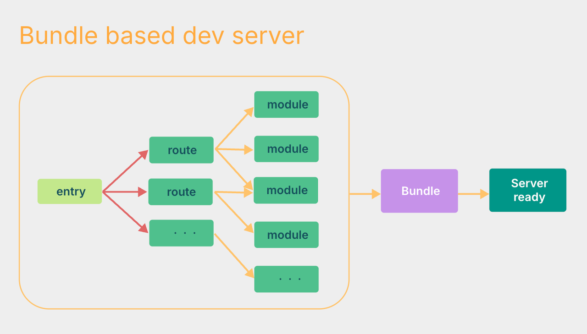
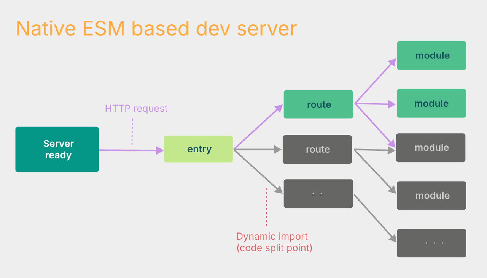
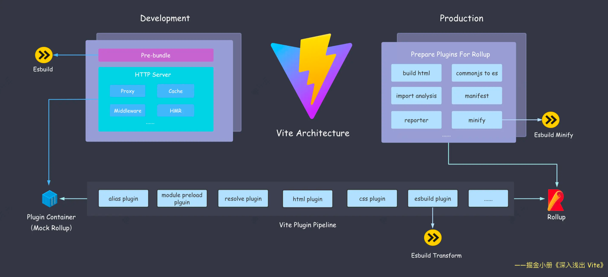
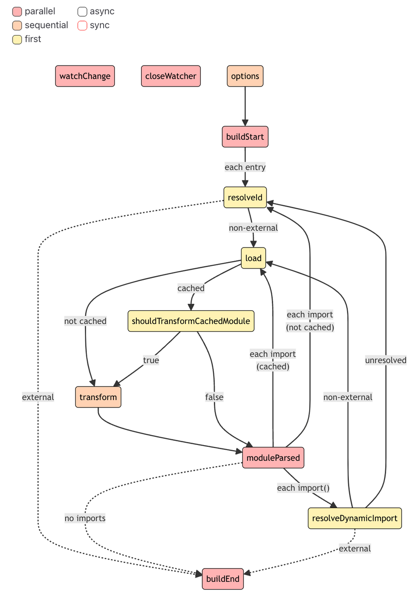
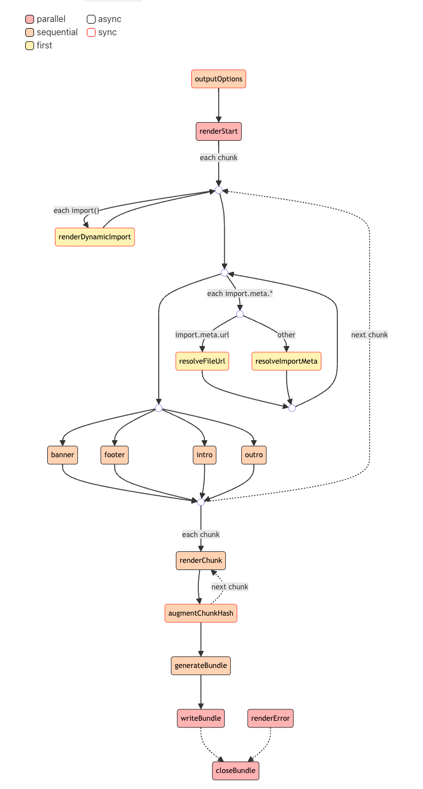

# 速通 vite

## 概述

### vite 是什么

webpack 大家都很熟悉，一个很完善的 web 构建工具，webpack 仓库是在 2013 年打的初版 tag 1.0.0-beta2

在那个时候，es6（es2015）都还没出生，模块规范还是以 node 的 commonjs（cjs）规范为主，浏览器仅支持立即执行函数（iife）
所以 webpack 产物是以 iife 和 cjs 格式为主的
esmodule（esm）规范是在后续的迭代中才渐渐支持
所以不可避免得对 esm 的特性支持是不彻底的

而 rollup，一个优秀的基于 esm 的库构建工具，在 2015 年基于 es6 的新特性顺势而生，首先支持了 tree shaking，更快，更小
可是此时浏览器仍然仅支持 iife
rollup 官方的定位也一直是库构建工具
一直没有提供开发服务器的功能，所以一直只能作为库构建工具

所以就有了那句话 在开发应用时使用 Webpack，开发库时使用 Rollup

在 2017 年底，浏览器原生支持了 esm，这就为 vite 的诞生奠定了基础

[can i use](https://caniuse.com/?search=type%20module)

到了 2020 年，vite 一开始只是尤雨溪的一个基于浏览器 esm 做 hmr 的 demo
[github](https://github.com/vuejs/vue-dev-server)

试验可行性后，他连肝很多天，很快就有了 vite1.0，基于 rollup 实现了开发服务器和构建指令
浏览器基于 esm 做 hmr 相比于 iife 会快不少，rollup 生态扩展性很强大，但是对比 webpack，开发和构建的效率提升并没有立竿见影

而这年，非 js 语言构建工具兴起，其中基于 go 语言的构建工具，esbuild 的性能极其恐怖

基于 1.0 的经验，vite2.0 重构了架构，官方源码中直接引入了 esbuild，vite 补全了最后一块拼图，正式拥有了作为新型前端构建工具的实力

[vite docs](https://vite.dev/blog/announcing-vite2.html)

vite 的文档一向写的很详细且明确，可以多阅读官方文档来学习

到这里，什么是 vite，就可以借用一下 vite 官方文档的描述了

- Vite 是一种新型前端构建工具，包括一个开发服务器和一套构建指令
- Vite 是一种具有明确建议的工具，具备合理的默认设置
- Vite 还提供了强大的扩展性，可通过其 插件 API 和 JavaScript API 进行扩展，并提供完整的类型支持

### vite 开发服务器为什么这么快

vite2.0 发布时，大家不可避免的都会有个疑问，vite 开发服务器为什么这么快

浏览器原生的 esm
在浏览器支持 esm 之前
构建工具的开发服务器都是 bundle 模式，冷启动时需要将我们的源码打包为浏览器支持的 js 格式，比如 webpack 的产物是 iife 格式
但是打包意味着构建工具需要将所有模块都处理成模块依赖图然后 bundle，大型项目的模块越来越多，速度就越来越慢
而哪怕只改动一个模块源码，hmr 也需要在 chunk 级进行更新


而 vite，利用了浏览器对 esm 的支持，让浏览器接管了一部分工作，实现了 no bundle 模式
浏览器自己就会对模块进行依赖解析，并且按需加载，使用网络请求的方式请求模块的 js 文件
所以 vite 冷启动时只需要启动开发服务器，等待浏览器发起 http 请求后也只需要编译首屏依赖的模块源码，而 hmr 时仅需编译改动的模块源码


双引擎架构 esbuild+rollup
vite 开发服务器，是将代码区分为两部分处理的
所以上面的对比着重强调了 no bundle 是开发服务器编译源码时

对于我们常用的 npm 依赖，因为要兼容 cjs 等格式，是需要 bundle 的
vite 会通过预构建的方式在冷启动时打包不兼容的 npm 依赖，打包成 esm 格式
而依赖预构建，就是使用了第一个引擎，esbuild

那么当开发服务器编译源码时呢，这里就涉及到架构了，我们先看一下架构图


可以看出 vite 开发服务器使用的插件和构建一样
没错，vite 开发服务器的插件系统是模拟的第二个引擎 rollup
编译源码使用的是模拟插件系统 PluginContainer 来执行这些插件
其中也包括了 vite 内部实现的 vite 插件 esbuildPlugin 来替代 babel，提高编译的速度

再从源码看一下 vite 内部解析的插件
从源码可以看出，vite 的插件是根据 isBuild 属性区分开发还是构建的，确实是同一套插件
这里可以再次引用 vite 文档的描述

- 你只需要编写一个 Vite 插件，就可以同时为开发环境和生产环境工作

```ts
export async function resolvePlugins(
  config: ResolvedConfig,
  prePlugins: Plugin[],
  normalPlugins: Plugin[],
  postPlugins: Plugin[]
): Promise<Plugin[]> {
  // ...

  return [
    ...(isDepsOptimizerEnabled(config, false) ||
    isDepsOptimizerEnabled(config, true)
      ? [
          isBuild
            ? optimizedDepsBuildPlugin(config)
            : optimizedDepsPlugin(config),
        ]
      : []),
    isBuild ? metadataPlugin() : null,
    !isWorker ? watchPackageDataPlugin(config.packageCache) : null,
    preAliasPlugin(config),
    aliasPlugin({
      entries: config.resolve.alias,
      customResolver: viteAliasCustomResolver,
    }),
    ...prePlugins, // enforce:'pre'
    modulePreload !== false && modulePreload.polyfill
      ? modulePreloadPolyfillPlugin(config)
      : null,
    resolvePlugin({
      ...config.resolve,
      root: config.root,
      isProduction: config.isProduction,
      isBuild,
      packageCache: config.packageCache,
      ssrConfig: config.ssr,
      asSrc: true,
      getDepsOptimizer: (ssr: boolean) => getDepsOptimizer(config, ssr),
      shouldExternalize:
        isBuild && config.build.ssr
          ? (id, importer) => shouldExternalizeForSSR(id, importer, config)
          : undefined,
    }),
    htmlInlineProxyPlugin(config),
    cssPlugin(config),
    config.esbuild !== false ? esbuildPlugin(config) : null,
    jsonPlugin(
      {
        namedExports: true,
        ...config.json,
      },
      isBuild
    ),
    wasmHelperPlugin(config),
    webWorkerPlugin(config),
    assetPlugin(config),
    ...normalPlugins, // enforce:null
    wasmFallbackPlugin(),
    definePlugin(config),
    cssPostPlugin(config),
    isBuild && buildHtmlPlugin(config),
    workerImportMetaUrlPlugin(config),
    assetImportMetaUrlPlugin(config),
    ...buildPlugins.pre,
    dynamicImportVarsPlugin(config),
    importGlobPlugin(config),
    ...postPlugins, // enforce:'post'
    ...buildPlugins.post,
    // internal server-only plugins are always applied after everything else
    ...(isBuild
      ? []
      : [clientInjectionsPlugin(config), importAnalysisPlugin(config)]),
  ].filter(Boolean) as Plugin[];
}
```

## 插件

vite 插件相对于 rollup 插件仅仅多了几个自定义钩子和 enforce 属性
所以 vite 可以直接使用大部分 rollup 插件，而且 vite 内部就用了很多

### rollup 插件

所以我们先学习一下 rollup 插件
rollup 插件和其他构建工具本质一样
就是在构建流程的指定时间调用钩子

rollup 的构建流程分为 Build 和 Output
其中 Build 钩子有下面这些


Output 有下面这些


可以看到钩子本身是有分类的
钩子首先分为基础的 async 和 sync，就是同步的还是异步的函数嘛，这个可以和下面的分类共存
另外 rollup 官方还将它分为三类

- first: 如果有多个插件实现此钩子，则钩子按顺序运行，直到钩子返回一个不是 null 或 undefined 的值
- sequential: 如果有多个插件实现此钩子，则所有这些钩子将按指定的插件顺序运行。如果钩子是 async，则此类后续钩子将等待当前钩子解决后再运行
- parallel: 如果有多个插件实现此钩子，则所有这些钩子将按指定的插件顺序运行。如果钩子是 async，则此类后续钩子将并行运行，而不是等待当前钩子

插件本身就是一个返回插件对象的函数
对象内包括了 rollup 约定的钩子函数

```ts
export default function vitePluginExamplePlugin(options = {}) {
  return {
    name: "vite-plugin-example-plugin",

    // resolveId 钩子，用于模块解析
    resolveId(source) {
      const cdnModules = ["lodash", "axios"];

      if (cdnModules.includes(source)) {
        return `https://cdn.jsdelivr.net/npm/${source}`;
      }

      return null; // 不处理其他类型的文件
    },

    // transform 钩子，在文件转换时被调用
    transform: {
      order: "pre", // 多个插件实现transform时，优先执行此插件的
      handler(code, id) {
        if (id.endsWith(".js")) {
          // 在代码开头添加注释
          const newCode = `// 我是注释\n${code}`;

          return {
            code: newCode,
          };
        }

        return null; // 不处理其他类型的文件
      },
    },
  };
}
```

另外钩子函数也可以配置为钩子对象，将函数放在 handler 属性中，这样我们可以同时使用 order 属性控制钩子顺序

- order: "pre" | "post" | null

#### rollup 钩子

rollup 钩子虽然比 webpack 少很多，但是看上图还是有二十多个了
我们只看看主要钩子
vite 中的 PluginContainer 也仅仅是模拟了主要钩子

```ts
export interface PluginContainer {
  options: InputOptions;
  getModuleInfo(id: string): ModuleInfo | null;
  buildStart(options: InputOptions): Promise<void>;
  resolveId(
    id: string,
    importer?: string,
    options?: {
      attributes?: Record<string, string>;
      custom?: CustomPluginOptions;
      skip?: Set<Plugin>;
      ssr?: boolean;
      /**
       * @internal
       */
      scan?: boolean;
      isEntry?: boolean;
    }
  ): Promise<PartialResolvedId | null>;
  transform(
    code: string,
    id: string,
    options?: {
      inMap?: SourceDescription["map"];
      ssr?: boolean;
    }
  ): Promise<{ code: string; map: SourceMap | { mappings: "" } | null }>;
  load(
    id: string,
    options?: {
      ssr?: boolean;
    }
  ): Promise<LoadResult | null>;
  watchChange(
    id: string,
    change: { event: "create" | "update" | "delete" }
  ): Promise<void>;
  close(): Promise<void>;
}
```

options
替换或操作传递给 rollup.rollup 的选项对象

buildStart
在每个 rollup.rollup 构建上调用

resolvedId
定义一个自定义解析器

load
定义一个自定义加载器

transform
可以被用来转换单个模块

buildEnd
在 Rollup 完成产物但尚未调用 generate 或 write 之前调用；也可以返回一个 Promise

closeBundle
可用于清理可能正在运行的任何外部服务

### vite 插件

vite 由于有一些内置插件，所以多了一个属性 enforce 来控制传入插件给 rollup 时相对于 vite 内置插件的顺序

- Alias
- 带有 enforce: 'pre' 的用户插件
- Vite 核心插件
- 没有 enforce 值的用户插件
- Vite 构建用的插件
- 带有 enforce: 'post' 的用户插件
- Vite 后置构建插件（最小化，manifest，报告）

注意，包括 vite 内置插件在内，传入后还是都由 rollup 插件系统解析顺序

#### vite 钩子

config
在解析 Vite 配置前调用

configResolved
在解析 Vite 配置后调用

configureServer
是用于配置开发服务器的钩子

configurePreviewServer
与 configureServer 相同，但用于预览服务器

transformIndexHtml
转换 index.html 的专用钩子

handleHotUpdate
执行自定义 HMR 更新处理
